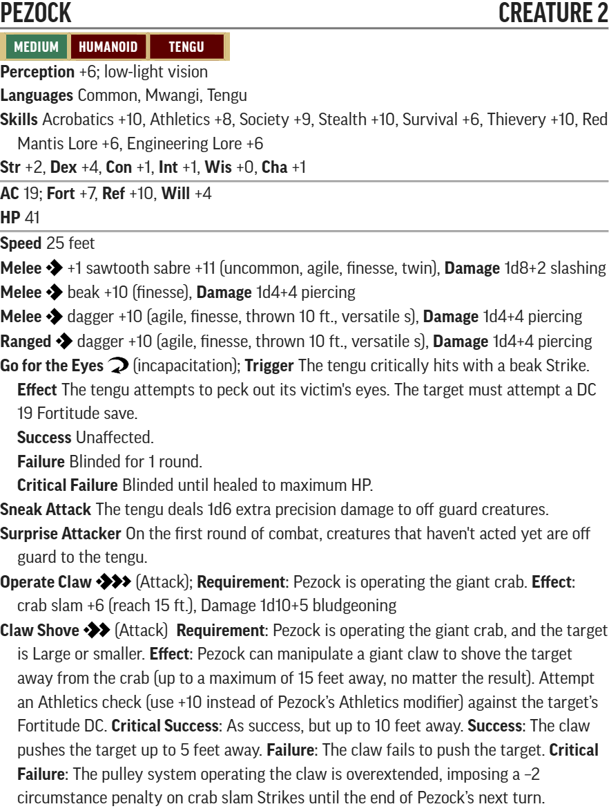
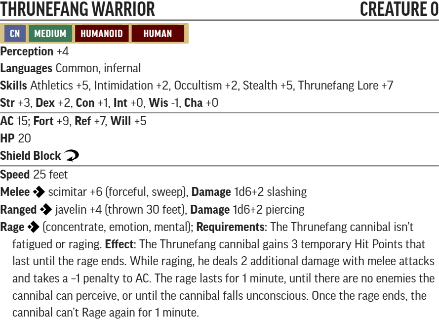

# Souls for Smuggler's Shiv (WIP)

[A Series of Dice-Based Events Discord](https://discord.gg/UQ8UD3H)

## Conversion Guide for Pathfinder Second Edition (2E)

  - This conversion guide only covers the items that have changed in 2E but not entirely to the Remaster. This includes NPCs and creatures, hazards, XP, treasure, and some tactics where they don't convert well from 1E.
  - The plot, backstory, color text, floor plans, maps, images and most tactics requires the original scenario.
  - Creatures, hazards, items, poisons, adjustments, etc. that exist in second edition are usually linked to the relevant entry in [Archives of Nethys - second edition](https://2e.aonprd.com/).
  - Unique and missing 2E creatures are built using [Monster Builder](http://monster.pf2.tools/) and their JSON, PDF and PNG files are in the statblocks directory so that you can use or update them for your own campaign as required. In some instances there are several variants available.
  - If you find an issue, error or omission, have a suggestion for improvement, or a better version of something, then post on the [discord server](https://discord.gg/UQ8UD3H) or create a pull request. This is a community project and we welcome and rely on community contributions.

## General GM information

  - This is a fan created unofficial guide, and what it contains is therefore a series of suggestions, that you can take, modify or leave as you see fit.
  - DCs are not converted to 2E, except where they are contained within a creature or hazard stat block, or are particularly significant. All other DCs are left to GM discretion. See [level based DCs](https://2e.aonprd.com/Rules.aspx?ID=554) for guidance.

## Party Levelling Milestones
- Level 2: after they've discovered the Jenivere and the Captains log
- Level 3: before they reach the Cannibal Ambush
- Level 4: before they enter the Azlanti Temple

Using Fast Track Advancement, as per the original AP, the target for this book is therefore 3,000 + plus random encounters = 3200-3xxx level adjusted XP.
## Section XP rewards

Part | Title                   | Max XP 
-----|-------------------------|-------
1    | Shipwrecked on the Shiv |  150  
2    | Exploring the Shiv      |  1977 
3    | The Cannibal Camp       |  xxx  
4    | Temple of Blood         |  xxx 
 

## Target Allocation of Treasure

Level | Total gp | Permanent Items (P)   | Consumables (C)                  | Cash  | Part
------|----------|-----------------------|----------------------------------|-------|-----
Lv1   | xxxgp    | **2nd:** x **1st:** x | **2nd:** x **1st:** x            | xxxgp | 
Lv2   | xxxgp    | **3rd:** x **2nd:** x | **3rd:** x **2nd:** x **1st:** x | xxxgp |
Lv3   | xxxgp    | **4th:** x **3rd:** x | **4th:** x **3rd:** x **2nd:** x | xxxgp | 
Lv4   | xxxgp    | **5th:** x **4th:** x | **5th:** x **4th:** x **3rd:** x | xxxgp |  

[Full Level to Wealth Chart](http://2e.aonprd.com/Rules.aspx?ID=581)

This adventure contains all [treasure](https://docs.google.com/spreadsheets/d/1atMQxRgSKBF4xaGR8UK_2yB75FY9n85B/edit?gid=216243941#gid=216243941) for 1st through 4th levels.

As a general rule divide the gp values of valuables by 10 to convert to 2E. Occasionally they are divided by 20 in order to fit the 2E wealth guidelines. 

All magical items in 1E treasure are replaced by 2E items in this guide.

It's assumed that even though NPCs may use consumable items in their possession, those items will still become part of the loot. If you decide not to do this, you should replace it with something else (or just increase the cash value of currency items).

Spellbooks (if any) are valued at 50% of the cost of "learn a spell" for the highest-level spells only, usually those currently memorized by the NPC.

Treasure was provided for a party of 4. If you have additional party members, include additional treasure and items per the "Full level to Wealth Chart" and accompanying information linked above.

There is no spare treasure. If your players miss something early on in the adventure, you should include additional items later.

## Friendly NPC Roster (WIP - Statblocks to be added)

Aeyris Mavato
Gelik Aberwhinge
Ishirou
Jask Derendi
Sasha Nevah
[Pezock]
Aycenia

## Random Encounter Bestiary (WIP - Statblocks to be added)

- 1-5: 1d6 [Dire Rats](https://2e.aonprd.com/Monsters.aspx?ID=3162&Redirected=1)
- 6-8: 1 [Ghoul](http://2e.aonprd.com/Monsters.aspx?ID=218)
- 9-12: 1d4 [Giant Centipedes](https://2e.aonprd.com/Monsters.aspx?ID=77)
- 13-18: 1 [Giant Spider](https://2e.aonprd.com/Monsters.aspx?ID=386)
- 19-21: 1d6 [Human(oid) Skeletons](https://2e.aonprd.com/Monsters.aspx?ID=372)
- 22-33: 1d6 [Jungle Goats](https://monster.pf2.tools/v/yrsJ3zzv-jungle-goat)
- 34-45: 2d4 [Monkeys](https://2e.aonprd.com/Monsters.aspx?ID=1231&Weak=true)
- 46-49: 1 [Spider Swarm](https://2e.aonprd.com/Monsters.aspx?ID=385&Elite=true)
- 50-59: 1d4 [Thrunefang Warrior](./statblocks/thrunefang_warrior.pdf)
- 60-64: 1d4 [Vipers](https://2e.aonprd.com/Monsters.aspx?ID=379)
- 65-68: 1 [Bat Swarm](https://2e.aonprd.com/Monsters.aspx?ID=45)
- 69-72: 1 [Constrictor Snake](https://monster.pf2.tools/v/RoRS9Wzy)
- 73-78: 1d4 [Dimorphodons](./statblocks/dimorphodon.pdf)
- 79-81: 1d6 [Human(oid) Zombies](https://2e.aonprd.com/Monsters.aspx?ID=3249)
- 82-84: [Pezock](./statblocks/pezock.pdf) or see L
- 85-89: 1 [Shiv Dragon](https://2e.aonprd.com/Monsters.aspx?ID=289)
- 90-96: 1d4 [Venomous Snakes](./statblocks/venomous_snake.pdf)
- 97-99: 1d4 [Shocker Lizards](https://2e.aonprd.com/Monsters.aspx?ID=802)
- 100: 1 [Winged Chupacabra](./statblocks/winged_chupacabra.pdf)

## Part 1: Shipwrecked on the Shiv (80-150xp, Party Level 1)

This is a fairly short part but serves the purpose of showing how dire their situation is. It should put into focus that they've need a safe place to camp, then start exploring the Shiv to track down anyone else from the Jenivere, as well as finding a way off the island.

### Feast on the Beach (60xp, low threat)

 - **Creatures:** 
    - 3x [Euryptids](https://2e.aonprd.com/Monsters.aspx?ID=1151) 
 - **Loot:** All of the castaway and party gear (if not given already)

### Taking Stock (10-40xp, RP Encounter)
 - 10xp for concluding the Jenivere sank or wrecked, 20xp for finding the footprints
 - 10xp for succeeding the Medicine check to confirm they were poisoned

### Setting Up Camp (10-50xp, RP Encounter)
 - 10xp for confirming the island is Smuggler's Shiv
 - 10xp, 20xp, 30xp, or 40xp for successful Lore checks via page 11.

## Part 2: Exploring the Shiv (1977xp on average, Party level 1-3)

This is THE BRUNT of this book. The party should hit Level 2 while exploring, and could even reach Level 3! Xp and threat level will be assumed as if the party takes the encounters in order and with the average xp, therefore with random encounters you can't always trust the threat level or xp.

### B. Wreck of the Jenivere (40xp, low threat)

  - **Creatures:** 
    - 1x [Euryptids, Elite](https://2e.aonprd.com/Monsters.aspx?ID=1151) 
  - **Loot:** Captain's Log

### C. Predator Dens (xp based on den, variable threat level)
- When a den has been cleared they can no longer be encountered in the random encounters, we suggest removing a random number corresponding to that from the random encounter table

#### C1. Dimorphodon Nest (30-90+20 xp, trivial to severe Threat)*4
- **Creatures:**
  - 1d3 [Dimorphodon](./statblocks/dimorphodon.pdf)
  - Award the PC's 20 xp for capturing a dimorphodon

#### C2. Venomous snake (40 xp, Low Threat)*3
- **Creatures:**
  - 1 [Venomous Snake](./statblocks/venomous_snake.pdf)

#### C3. Giant Spider (60 xp, Low Threat)*3
- **Creatures:**
  - 1 [Giant Spider](https://2e.aonprd.com/Monsters.aspx?ID=3207&Elite=true&NoRedirect=1)

#### C4. Constrictor Snake (60 xp, Low threat)*3
- **Creatures:**
  - 1 [Constrictor Snake](https://monster.pf2.tools/v/RoRS9Wzy)

#### C5. Giant Crab (60 xp, Low Threat)*5
- **Creatures:**
  - 1 [Giant Crab](https://2e.aonprd.com/Monsters.aspx?ID=588)

#### C6. Shocker Lizards 60 xp, Low Threat)*3
- **Creatures:**
  - 2 [Shocker Lizard](https://2e.aonprd.com/Monsters.aspx?ID=802)

#### C7. Shiv Dragon (60 xp, Low Threat)*6
- **Creatures:**
  - 1 [Shiv Dragon](https://2e.aonprd.com/Monsters.aspx?ID=289)

#### C8. Cave Fishers (60 xp, Low Threat)*6
- **Creatures:**
  - 1 [Cave Fisher](https://2e.aonprd.com/Monsters.aspx?ID=580)

### D. Shipwrecks (80/90 xp per ship wreck with encounter, Moderate/Severe Threat) Assumes Level 2 from here on
Your group should on average encounter 2 of each group totaling 340 xp
- 4 [Human(oid) Zombie](https://2e.aonprd.com/Monsters.aspx?ID=3249)
- 6 [Human(oid) Skeleton](https://2e.aonprd.com/Monsters.aspx?ID=372)

### E. Viper Nettles (20 xp)
-Award the PC's 20 xp for curing Aerys Mavato's disease

### F. Yarzoth's Landfall (10 xp)
-Award the PC's 10 xp for identifying the items

### G. The Brine Demon (80xp, Low Threat)
-Award the PC's xp as if they slew Captain Avret Kinkarian if the make peace with him using the locket.
-Award the PC's 20 xp for proving Jasks innocense
- [Captain Avret Kinkarian]

### H. Creeper's Clearing (60xp, Low Threat)
- 1 [Yellow Musk Creeper](https://2e.aonprd.com/Monsters.aspx?ID=867)
- 2 [Yellow Musk Zombie](https://2e.aonprd.com/Monsters.aspx?ID=868)

### I. Abandoned Camps (40xp)
#### I1. Bloody doll camp (30 xp, Trivial Threat)
- 2 [Yellow Musk Zombie](https://2e.aonprd.com/Monsters.aspx?ID=868)

#### I2. Crow's Tooth Camp (10 xp)
-Award the PC's 10 xp for finding the dagger and determining that it is the mark of the red mantis

### J. Spiked Snares (12xp, Trivial Threat)*10
- [Spiked Trap](https://2e.aonprd.com/Hazards.aspx?ID=217)

### K. The Treasure Pit (80xp, Low Threat) Assumes Level 3 from here on
- 2 [Lacedons](https://2e.aonprd.com/Monsters.aspx?ID=1865)
- Award the PC's 20 xp for finding the treasure pit and sharing it with Ishirou

### L. Pezocks Crab (30xp, threat level, RP Encounter)
- [Pezock](./statblocks/pezock.pdf)
- 

### M. Cannibal Ambush (27xp, RP encounter)
- [Spiked Trap](https://2e.aonprd.com/Hazards.aspx?ID=217)
- 1 [Thrunefang Warrior](./statblocks/thrunefang_warrior.pdf)
- 

### N. Abandoned Hut (10xp, RP Encounter)
- Award the PC's 10 xp for finding the notes

### Q. The Silent Island (30xp,Trivial Threat)*3
- 2 [Vegepygmie](./statblocks/vegepygmie.pdf)
-  

### R. The Nightvoice (80xp, Low Threat)
- 2 [Vegepygmie](./statblocks/vegepygmie.pdf)
- 1 [vegepygmie boss](./statblocks/vegepygmie_boss.pdf)
- 
- Award the PC's 20 xp for finding the Nightvoice

### S. The Fungus God (40xp, Trivial Threat)
- 1 [Fiendis Violet Fungus](https://2e.aonprd.com/Monsters.aspx?ID=853)

### U. The Spirit of the Hill (60xp, RP Encounter)
- [Aycenia](https://2e.aonprd.com/Monsters.aspx?ID=3112&Elite=true&NoRedirect=1)
- She additionnaly has 3 level 2 heal spells prepared per day
- Award the PC's xp as if the defeted Aycenia if they complete her quest

## Part 3: The Cannibal Camp  (###xp, Party Level 3)
### V. TThrunefang Camp
-22 [Thrunefang Warrior](./statblocks/thrunefang_warrior.pdf)
- 
- Remember to subtract any thrunefang patrols encountered
#### V1. Shiv Dargon (xxp, Threat)
-

#### V2. Shiv Dargon (xxp, Threat)
- 

#### V3. Shiv Dargon (xxp, Threat)
- 

#### V4. Shiv Dargon (xxp, Threat)
- 

#### V5. Shiv Dargon (xxp, Threat)
- 

#### V6. Shiv Dargon (xxp, Threat)
- 

#### V7. Shiv Dargon (xxp, Threat)
- 

#### V8. Shiv Dargon (xxp, Threat)
- 

#### V9. Shiv Dargon (xxp, Threat)
- 

#### V10. Shiv Dargon (xxp, Threat)
- 

#### V11. Shiv Dargon (xxp, Threat)
- 

#### V12. Shiv Dargon (xxp, Threat)
- 

#### V13. Shiv Dargon (xxp, Threat)
- 

#### V14. Shiv Dargon (xxp, Threat)
- 

#### V15. Shiv Dargon (xxp, Threat)
- 

#### V16. Shiv Dargon (xxp, Threat)
- 

#### V17. Shiv Dargon (xxp, Threat)
- 

#### V18. Shiv Dargon (xxp, Threat)
- 

#### V19. Shiv Dargon (xxp, Threat)
- 

#### V20. Shiv Dargon (xxp, Threat)
- 

#### V21. Shiv Dargon (xxp, Threat)
- 

#### V22. Shiv Dargon (xxp, Threat)
- 

#### V23. Shiv Dargon (xxp, Threat)
- 

#### V24. Shiv Dargon (xxp, Threat)
- 

#### V25. Shiv Dargon (xxp, Threat)
- 

#### V26. Shiv Dargon (xxp, Threat)
- 

#### V27. Shiv Dargon (xxp, Threat)
-

#### V28. Shiv Dargon (xxp, Threat)
- 

## Part 4: Temple of Blood  (###xp, Party Level 4)

## -- End of Serpent's Skull: Souls for Smugglers Shiv 2E conversion guide --

## Recommended Tool

http://monster.pf2.tools/ uses JSON files that can be easily imported/exported. This repository ideally will hold those files publicly sourced and created, as well as other tools/files. 
Please do not submit PDF files or entire texts of the AP. Only submit modifications for the DC and NPCs/Monsters. Please also include a page number/map section label so GMs can cross-reference.
